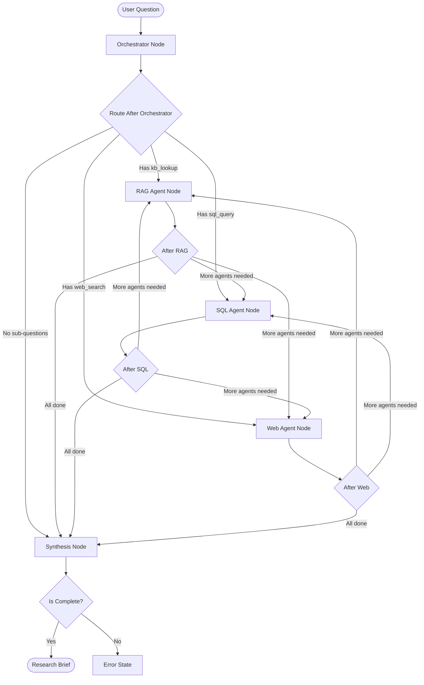

# System Architecture & Flow

## Overview

Valiance is a **corpus-agnostic, multi-agent deep research system** that orchestrates specialized AI agents to answer complex questions by decomposing them into sub-questions, retrieving evidence from multiple sources, and synthesizing comprehensive research briefs.

---

## High-Level Architecture

```
┌─────────────────────────────────────────────────────────────┐
│                      User Question                          │
└────────────────────┬────────────────────────────────────────┘
                     │
                     ▼
┌─────────────────────────────────────────────────────────────┐
│                  LangGraph Orchestration                    │
│  ┌──────────────────────────────────────────────────────┐  │
│  │  Orchestrator Agent                                   │  │
│  │  • Analyzes question complexity                       │  │
│  │  • Decomposes into sub-questions                      │  │
│  │  • Routes to appropriate agents                       │  │
│  └──────────────┬───────────────────────────────────────┘  │
│                 │                                           │
│       ┌─────────┼─────────┬──────────────┐                 │
│       │         │         │              │                 │
│       ▼         ▼         ▼              ▼                 │
│  ┌────────┐ ┌─────┐ ┌────────┐ ┌───────────────┐          │
│  │  RAG   │ │ SQL │ │  Web   │ │   Compute     │          │
│  │ Agent  │ │Agent│ │ Agent  │ │   Agent       │          │
│  └────┬───┘ └──┬──┘ └───┬────┘ └───────┬───────┘          │
│       │        │        │              │                   │
│       └────────┴────────┴──────────────┘                   │
│                         │                                  │
│                         ▼                                  │
│  ┌──────────────────────────────────────────────────────┐  │
│  │  Synthesis Agent                                      │  │
│  │  • Composes research brief                            │  │
│  │  • Verifies claims against sources                    │  │
│  │  • Generates citations                                │  │
│  └──────────────────────────────────────────────────────┘  │
│                         │                                  │
└─────────────────────────┼──────────────────────────────────┘
                          ▼
                ┌──────────────────┐
                │  Research Brief  │
                └──────────────────┘
```

---

## Detailed LangGraph Flow

### Complete Node Execution Flow



---

## Component Architecture

### 1. **Ingestion Pipeline**

```
corpus/pdfs/          corpus/databases/
     │                      │
     ▼                      ▼
┌─────────────────────────────────┐
│   Document Indexer              │
│   • PDF chunking (400 chars)    │
│   • Metadata extraction          │
│   • Schema introspection (SQL)  │
└──────────┬──────────────────────┘
           │
     ┌─────┼─────┐
     ▼     ▼     ▼
┌────────┐ ┌────────┐ ┌────────────┐
│ChromaDB│ │ BM25   │ │ Registry   │
│Collections│ Indexes│ │ (Centroids)│
└────────┘ └────────┘ └────────────┘
```

**File:** `ingest.py`, `src/ingestion/indexer.py`

**Process:**
1. Scans `corpus/pdfs/` for PDF files
2. Chunks documents (400 chars, 50 char overlap)
3. Generates embeddings using `sentence-transformers/all-MiniLM-L6-v2`
4. Stores in ChromaDB collections (one per document)
5. Builds BM25 inverted index
6. Computes collection centroid (mean embedding)
7. Scans `corpus/databases/` for SQLite files
8. Introspects schemas and sample data
9. Writes metadata to `registry.json`

---

### 2. **Query Execution Pipeline**

#### Stage 1: Orchestration

```
User Question
     │
     ▼
┌─────────────────────────────────────┐
│  Orchestrator Agent                 │
│  ┌───────────────────────────────┐  │
│  │ LLM Prompt:                   │  │
│  │ • Available collections       │  │
│  │ • Available databases         │  │
│  │ • Task: Decompose question    │  │
│  └───────────────────────────────┘  │
│                │                    │
│                ▼                    │
│  ┌───────────────────────────────┐  │
│  │ LLM Response:                 │  │
│  │ [                             │  │
│  │   {                           │  │
│  │     id: "sq_1",               │  │
│  │     question: "...",          │  │
│  │     intent: "kb_lookup",      │  │
│  │     target: "collection_01"   │  │
│  │   }                           │  │
│  │ ]                             │  │
│  └───────────────────────────────┘  │
└─────────────────────────────────────┘
```

**File:** `src/agents/orchestrator.py`

**Prompting Strategy:**
- Provides full registry context (collections + databases)
- Instructs LLM to decompose complex questions
- Specifies intent types: `kb_lookup`, `sql_query`, `web_search`, `compute`
- Routes each sub-question to appropriate target

---

#### Stage 2: Agent Execution

##### **RAG Agent (Knowledge Base Lookup)**

**File:** `src/agents/rag_agent.py`

```
Sub-Question: "What models does Meridian offer?"
Target: 01_meridian_product_catalog
     │
     ▼
┌─────────────────────────────────────────────────┐
│  FAST PATH (DIRECT_RETRIEVAL=true)              │
│  Skip to Step 3                                 │
└─────────────────────────────────────────────────┘
     │
     ▼
┌─────────────────────────────────────────────────┐
│  AGENTIC PATH (DIRECT_RETRIEVAL=false)          │
│                                                 │
│  Step 1: Query Formulation                      │
│  ┌───────────────────────────────────────────┐  │
│  │ LLM Prompt:                               │  │
│  │ • Sub-question                            │  │
│  │ • Collection description                  │  │
│  │ • Previous attempts (if retrying)         │  │
│  │ → Output: Optimized search query          │  │
│  └───────────────────────────────────────────┘  │
│                                                 │
│  Step 2: Hybrid Retrieval                       │
│  ┌───────────────────────────────────────────┐  │
│  │ Dense Search (ChromaDB)                   │  │
│  │ • Embed query                             │  │
│  │ • ANN search (HNSW)                       │  │
│  │ • Top 5 results                           │  │
│  └───────────────────────────────────────────┘  │
│  ┌───────────────────────────────────────────┐  │
│  │ Sparse Search (BM25)                      │  │
│  │ • Tokenize query                          │  │
│  │ • BM25 scoring                            │  │
│  │ • Top 5 results                           │  │
│  └───────────────────────────────────────────┘  │
│  ┌───────────────────────────────────────────┐  │
│  │ Reciprocal Rank Fusion (RRF)             │  │
│  │ • Merge rankings                          │  │
│  │ • Return top 5 fused results              │  │
│  └───────────────────────────────────────────┘  │
│                                                 │
│  Step 3: Sufficiency Check                      │
│  ┌───────────────────────────────────────────┐  │
│  │ LLM Prompt:                               │  │
│  │ • Sub-question                            │  │
│  │ • Retrieved evidence                      │  │
│  │ → Is evidence sufficient?                 │  │
│  │ → If no, reformulate query & retry        │  │
│  └───────────────────────────────────────────┘  │
│                                                 │
│  Loop up to MAX_RAG_ITERATIONS times            │
└─────────────────────────────────────────────────┘
     │
     ▼
Evidence Chunks (with citations)
```

**Key Features:**
- **Centroid Routing**: Matches question to most relevant collection via cosine similarity
- **Hybrid Search**: Combines dense (semantic) + sparse (keyword) retrieval
- **Agentic Loop**: Reformulates queries if initial results insufficient
- **Fast Path**: Skip agentic loop for speed (DIRECT_RETRIEVAL=true)

---

##### **SQL Agent (Structured Data Query)**

**File:** `src/agents/sql_agent.py`

```
Sub-Question: "What were Q4 sales?"
Target: sales.sqlite
     │
     ▼
┌─────────────────────────────────────┐
│  Step 1: Schema Retrieval           │
│  • Load database schema from        │
│    registry.json                    │
│  • Include table names, columns     │
│  • Include sample data              │
└──────────┬──────────────────────────┘
           ▼
┌─────────────────────────────────────┐
│  Step 2: SQL Generation             │
│  ┌───────────────────────────────┐  │
│  │ LLM Prompt:                   │  │
│  │ • Sub-question                │  │
│  │ • Database schema             │  │
│  │ • Rules: SELECT only          │  │
│  │ → Output: SQL query           │  │
│  └───────────────────────────────┘  │
└──────────┬──────────────────────────┘
           ▼
┌─────────────────────────────────────┐
│  Step 3: Safe Execution             │
│  • Validate: Only SELECT allowed    │
│  • Execute query                    │
│  • Format results as markdown table │
└──────────┬──────────────────────────┘
           ▼
SQL Result (as structured text)
```

**Safety:**
- Only SELECT queries allowed (regex validation)
- No INSERT, UPDATE, DELETE, DROP
- Read-only database connections

---

##### **Web Agent (External Search)**

**File:** `src/agents/web_agent.py`

```
Sub-Question: "Latest industry trends?"
Needs Web: true
     │
     ▼
┌─────────────────────────────────────┐
│  Tavily Search API                  │
│  • Search query                     │
│  • Max 3 results                    │
│  • Returns: URL, title, snippet     │
└──────────┬──────────────────────────┘
           ▼
Web Evidence (URLs + content)
```

**When Used:**
- RAG agent sets `needs_web=true` if question requires real-time data
- Only executes if explicitly needed (not run by default)

---

#### Stage 3: Synthesis

**File:** `src/agents/synthesis.py`

```
All Sub-Results
     │
     ▼
┌─────────────────────────────────────────────────┐
│  Step 1: Compose Research Brief                │
│  ┌───────────────────────────────────────────┐  │
│  │ LLM Prompt:                               │  │
│  │ • Original question                       │  │
│  │ • All evidence from all agents            │  │
│  │ • Instructions:                           │  │
│  │   - Executive Summary                     │  │
│  │   - Findings (by sub-question)            │  │
│  │   - Sources                               │  │
│  │   - Cite every claim                      │  │
│  │ → Output: Markdown research brief         │  │
│  └───────────────────────────────────────────┘  │
└─────────────┬───────────────────────────────────┘
              ▼
┌─────────────────────────────────────────────────┐
│  Step 2: Verification (Optional)                │
│  SKIP if SKIP_VERIFICATION=true                 │
│  ┌───────────────────────────────────────────┐  │
│  │ LLM Prompt:                               │  │
│  │ • Research brief                          │  │
│  │ • All evidence                            │  │
│  │ → Verify every claim against sources      │  │
│  │ → Output: Verification report             │  │
│  └───────────────────────────────────────────┘  │
└─────────────┬───────────────────────────────────┘
              ▼
┌─────────────────────────────────────┐
│  Final Research Brief               │
│  • Executive summary                │
│  • Detailed findings                │
│  • Citations                        │
│  • Verification status              │
└─────────────────────────────────────┘
```

---

## Data Flow

### State Management (Pydantic Models)

**File:** `src/models.py`

```python
ResearchState
├── original_question: str
├── sub_questions: List[SubQuestion]
│   ├── id: str
│   ├── question: str
│   ├── intent: str (kb_lookup | sql_query | web_search | compute)
│   └── target_collection: str
├── sub_results: List[SubQuestionResult]
│   ├── sub_question_id: str
│   ├── question: str
│   ├── evidence: List[EvidenceChunk]
│   │   ├── content: str
│   │   ├── source: str
│   │   ├── page: int | None
│   │   └── source_type: SourceType (pdf | sql | web | computed)
│   ├── sql_result: str | None
│   ├── computed_result: str | None
│   ├── sufficient: bool
│   ├── iterations: int
│   └── agent_used: str
├── final_brief: str
├── is_complete: bool
├── needs_web: bool
├── error: str | None
├── verification_passed: bool
├── verification_notes: str
└── citations: List[dict]
```

**State Transitions:**
1. **Initial**: `original_question` set, rest empty
2. **After Orchestrator**: `sub_questions` populated
3. **After Each Agent**: Corresponding `sub_results` appended
4. **After Synthesis**: `final_brief`, `verification_passed` set
5. **Final**: `is_complete = True`

---

## Routing Logic

### Conditional Edge Functions

**File:** `src/graph.py`

```python
def route_after_orchestrator(state):
    """Routes from orchestrator to first agent."""
    if no sub_questions:
        return "synthesis"  # Fallback
    
    for sq in sub_questions:
        if sq.intent == "kb_lookup":
            return "rag_agent"
        if sq.intent == "sql_query":
            return "sql_agent"
        if sq.intent == "web_search" and state.needs_web:
            return "web_agent"
    
    return "synthesis"

def route_after_rag(state):
    """Routes from RAG agent to next agent or synthesis."""
    # Check if there are unprocessed sub-questions
    for sq in sub_questions:
        if sq not processed yet:
            if sq.intent == "sql_query":
                return "sql_agent"
            if sq.intent == "web_search":
                return "web_agent"
    
    return "synthesis"

# Similar logic for route_after_sql, route_after_web
```

**Routing Rules:**
- Process all `kb_lookup` questions first (RAG agent)
- Then process `sql_query` questions (SQL agent)
- Then process `web_search` if needed (Web agent)
- Finally, route to synthesis when all sub-questions processed

---

## Observability & Tracing

### Dual Tracing System

```
┌─────────────────────────────────────┐
│  Local JSON Traces                  │
│  File: traces/trace_*.json          │
│  • Custom metadata                  │
│  • Timing breakdowns                │
│  • Error details                    │
└─────────────────────────────────────┘

┌─────────────────────────────────────┐
│  LangSmith Cloud Tracing            │
│  • Full LLM calls (prompts/outputs) │
│  • Token counts & costs             │
│  • Graph execution flow             │
│  • Visual debugging                 │
└─────────────────────────────────────┘
```

**File:** `src/tracer.py`

**Captured Metrics:**
- Total duration
- Per-node execution time
- LLM token usage
- Error rates
- Evidence retrieval counts

---

## Performance Modes

### Latency Breakdown

| Component | Full Quality | Balanced | Ultra-Fast |
|-----------|--------------|----------|------------|
| **Orchestrator** | 2-3s | 2-3s | 2-3s |
| **RAG Query Formulation** | 2-3s | 2-3s | ⚡ **Skipped** |
| **Hybrid Retrieval** | 0.5-1s | 0.5-1s | 0.5-1s |
| **RAG Sufficiency Check** | 2-3s | 2-3s | ⚡ **Skipped** |
| **Additional Iterations** | 4-8s | ⚡ **0s** | ⚡ **0s** |
| **Synthesis** | 3-4s | 3-4s | 3-4s |
| **Verification** | 2-3s | ⚡ **Skipped** | ⚡ **Skipped** |
| **TOTAL** | **~18s** | **~12s** | **~5s** |

### Configuration

```bash
# Ultra-Fast Mode (Current)
DIRECT_RETRIEVAL=true        # Skip query formulation
SKIP_VERIFICATION=true       # Skip verification
MAX_RAG_ITERATIONS=1         # No retries

# Balanced Mode
DIRECT_RETRIEVAL=false       # Use agentic retrieval
SKIP_VERIFICATION=true       # Skip verification
MAX_RAG_ITERATIONS=1         # No retries

# Full Quality Mode
DIRECT_RETRIEVAL=false       # Use agentic retrieval
SKIP_VERIFICATION=false      # Verify claims
MAX_RAG_ITERATIONS=3         # Up to 3 attempts
```

---

## Technology Stack

### Core Framework
- **LangGraph 0.2.73**: State machine orchestration
- **LangChain 0.3.25**: LLM abstractions, tool decorators
- **Pydantic 2.10.6**: Type-safe state management

### LLM Infrastructure
- **OpenRouter**: LLM API gateway
- **Model**: `openai/gpt-3.5-turbo` (configurable)
- **LangSmith**: Cloud observability

### Retrieval Stack
- **ChromaDB 0.6.3**: Vector database (HNSW indices)
- **sentence-transformers**: Embedding model (all-MiniLM-L6-v2)
- **rank-bm25**: Sparse retrieval (BM25Okapi)
- **RRF**: Reciprocal Rank Fusion for hybrid search

### Data Sources
- **PDFs**: Extracted via PyPDF2
- **SQLite**: Direct queries via sqlite3
- **Web**: Tavily search API

### UI/UX
- **Rich 13.9.4**: Terminal UI (panels, tables, markdown)
- **Colorful console output**: Progress indicators, formatted briefs

---

## Scalability Considerations

### Current Limitations
- **Sequential agent execution**: Agents run one at a time
- **Single LLM endpoint**: One request at a time
- **In-memory state**: State held in Python process

### Future Optimizations
1. **Parallel agent execution**: Run RAG + SQL agents concurrently
2. **Streaming responses**: Stream synthesis as it's generated
3. **Persistent checkpoints**: Save state to disk (LangGraph feature)
4. **Distributed retrieval**: Shard ChromaDB across multiple nodes
5. **Model parallelism**: Route different sub-questions to different models
6. **Caching**: Cache LLM responses for identical queries

---

## Security & Safety

### Data Privacy
- All data processed locally (except LLM API calls)
- No data stored on cloud (except LangSmith traces)
- SQLite files read-only

### LLM Safety
- SQL queries restricted to SELECT only
- Compute tool uses AST parsing (no `eval()`)
- All prompts include safety instructions

### Error Handling
- Graceful degradation (agents skip if collection missing)
- Validation errors logged, execution continues
- State always serializable (no Python objects in state)

---

## File Structure

```
Valiance/
├── corpus/
│   ├── pdfs/                    # Input PDFs
│   └── databases/               # Input SQLite files
├── chroma_db/                   # Vector embeddings (per-doc collections)
├── bm25_indexes/                # Sparse indices (pickled)
├── traces/                      # Local execution traces
├── src/
│   ├── agents/
│   │   ├── orchestrator.py      # Question decomposition
│   │   ├── rag_agent.py         # Knowledge base retrieval
│   │   ├── sql_agent.py         # Database queries
│   │   ├── web_agent.py         # Web search
│   │   └── synthesis.py         # Brief composition
│   ├── ingestion/
│   │   └── indexer.py           # Document indexing
│   ├── retrieval/
│   │   └── hybrid.py            # RRF fusion
│   ├── tools/
│   │   ├── kb_search.py         # Centroid routing
│   │   └── compute.py           # Safe computation
│   ├── config.py                # Settings management
│   ├── models.py                # Pydantic state models
│   ├── registry.py              # Collection metadata
│   ├── graph.py                 # LangGraph definition
│   └── tracer.py                # Local tracing
├── ingest.py                    # Ingestion CLI
├── main.py                      # Query execution CLI
├── registry.json                # Collection metadata
└── .env                         # API keys & config
```

---

## Execution Example

### Query: "What models does Meridian offer?"

**1. Orchestrator Output:**
```json
[
  {
    "id": "sq_1",
    "question": "What models does Meridian offer?",
    "intent": "kb_lookup",
    "target_collection": "01_meridian_product_catalog"
  }
]
```

**2. RAG Agent Process:**
- Centroid routing → `01_meridian_product_catalog` (highest similarity)
- Direct retrieval query: "What models does Meridian offer?"
- Hybrid search returns 5 chunks from product catalog
- Evidence includes: M-100, M-100R, M-200, M-300, M-300XL specs

**3. Synthesis Output:**
```markdown
## Executive Summary
Meridian offers a range of autonomous mobile robot (AMR) models...

## Findings
### Models Offered by Meridian
According to [Source: 01_Meridian_Product_Catalog.pdf, p.1]:
- Meridian M-100: Compact AMR, 35 kg payload, $12,500
- Meridian M-100R: Compact AMR Rev B, $13,400
...

## Sources
1. Meridian Robotics Product Catalog [01_Meridian_Product_Catalog.pdf]
```

**4. Verification:**
- ✅ PASSED: All claims verified against sources

**Duration:** ~5 seconds (Ultra-Fast Mode)

---

## Configuration Guide

See [PERFORMANCE.md](PERFORMANCE.md) for detailed optimization guide.
See [LANGSMITH.md](LANGSMITH.md) for observability setup.
